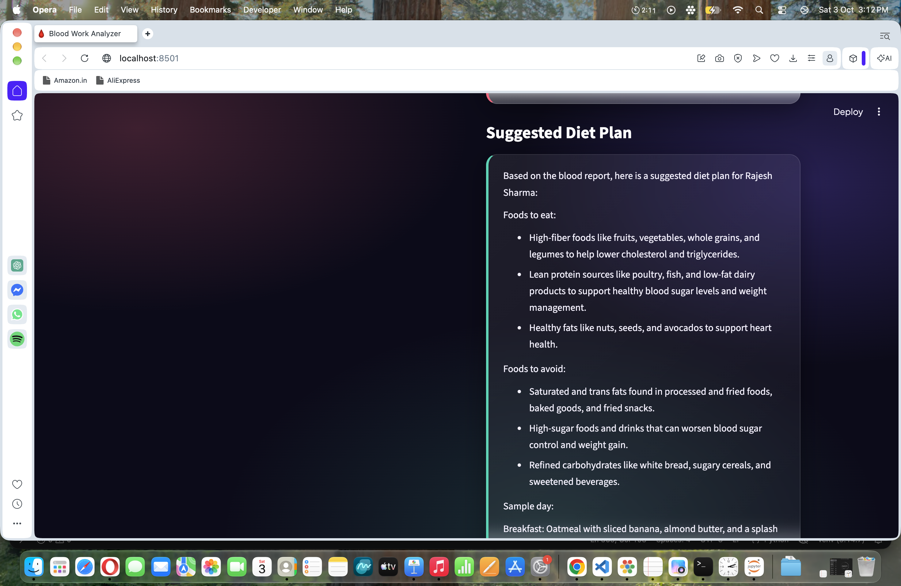
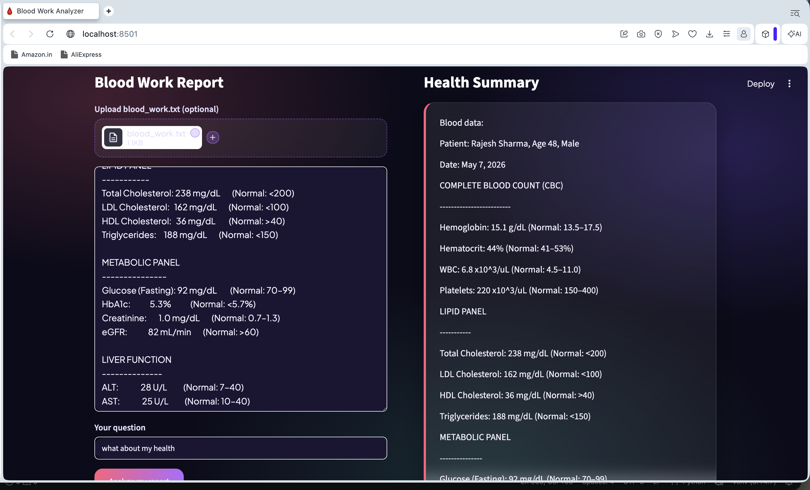
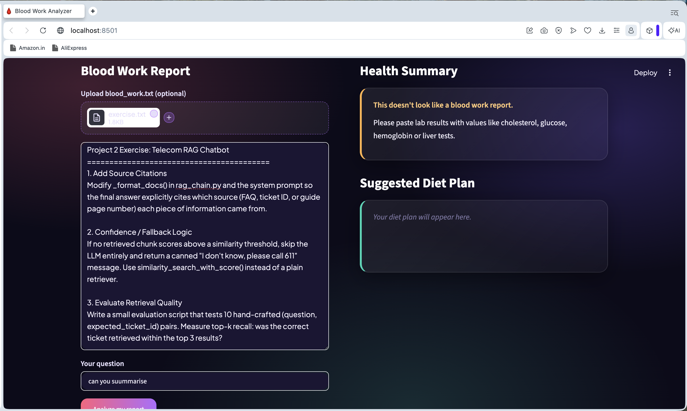

# 🩸 Blood Work Analyzer

An AI-powered Streamlit app that reads your blood test report and gives you a
plain-language **health summary** and a **suggested diet plan**. It runs fully
on your own machine with a local Ollama model, so your lab data never leaves your computer.

## ✨ Features

- Paste or upload a blood work report (`.txt`)
- Ask your own question, such as "what about my health"
- Simple, short health summary: conditions, counts and causes
- Diet plan built from the abnormal values: foods to eat, foods to avoid, sample day
- Rejects input that isn't a blood report
- Dark gradient glass UI

## 📸 Screenshots





## 🛠️ Tech Stack

- [Streamlit](https://streamlit.io/) for the UI
- [LangChain](https://www.langchain.com/) with `langchain-ollama`
- [Ollama](https://ollama.com/) running `llama3.2` locally

## 🚀 Getting Started

1. Clone the repo

```bash
git clone https://github.com/Sinan-ck/blood-work-analyzer.git
cd blood-work-analyzer
```

2. Install the dependencies

```bash
python -m venv venv
source venv/bin/activate
pip install -r requirements.txt
```

3. Install [Ollama](https://ollama.com/) and pull the model

```bash
ollama pull llama3.2
```

4. Run the app

```bash
streamlit run app.py
```

Then open http://localhost:8501.

## ⚙️ How It Works

1. A keyword check confirms the text looks like a blood report.
2. The report and your question go to `llama3.2` for the health summary.
3. A second prompt creates the diet plan from the abnormal values.
4. The markdown answers are rendered as styled cards.

## ⚠️ Disclaimer

This project is for information only and is **not medical advice**. Always talk
to a qualified doctor about your results.
